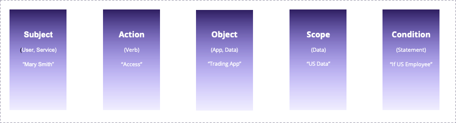

# IDQL Core Specification

Draft: 20-May-2024

Revised: 5-Nov-2024

This specification defines the IDQL policy language. IDQL is designed to be a general purpose, platform-neutral
policy language for use in hybrid and multi-cloud environments. IDQL is intended support:

* Centralized management and control of cloud based applications
* A platform-neutral specification that can be mapped into proprietary policy systems or be interpreted directly
* Existing standard schemas where possible.

## Conventions and Terminology

All IDQL specifications use a common formatting convention and terminology. For information
see [Conventions](specs/Conventions.md).

## Copyright Notice

Copyright (C) 2021, Strata Identity Inc. All rights reserved.

This document is available for use under the APL 2.0 [Apache License](LICENSE).

Table of Contents
=================

* [1 Introduction](#1-introduction)
* [2 IDQL And The Hexa Project](#2-idql-and-the-hexa-project)
* [3 IDQL Policy Statements](#3-idql-policy-statements)
    * [3.1 Meta Information](#31-meta-clause)
    * [3.2 Subject Clause](#32-subject-clause)
    * [3.3 Action Clause](#33-actions-clause)
        * [3.3.1 HTTP Request URIs](#331-http-requests)
        * [3.3.3 Azure ARN Actions](#333-microsoft-azure-urns-for-actions)
        * [3.3.4 Google URN Actions](#334-google-urns-for-actions)
        * [3.3.5 AuthZen and Policy-OPA Integrations Actions](#335-authzen-and-hexa-policy-opa)
    * [3.4 Object Clause](#34-object-clause)
    * [3.5 Scope Clause](#35-scope-clause)
    * [3.6 Condition Clause](#36-condition-clause)

---

## 1 Introduction

Identity Query Language (IDQL) is a security policy language that can be expressed in
[JSON (RFC8259)](https://datatracker.ietf.org/doc/html/rfc8259). IDQL is used a multi-platform neutral policy
language for distributed, hybrid, multi-cloud environments. The intent of IDQL is that all components,
of a cloud based application from network to application layers may manage access regardless of proprietary platform or
container. IDQL policy may be enforced directly or mapped and converted into
proprietary platforms that implement IDQL enabled gateways (see: [Hexa Project](https://github.com/idql-org/hexa)).



An IDQL policy rule identifies a `subject` provider that is permitted one or more `actions` against a target
`object` under an optional `condition`, and with a `scope` that restricts the permitted action.

IDQL used by [Hexa Policy Mapper](https://github.com/hexa-org/policy-mapper) and related
projects [Policy-Orchestrator](https://github.com/hexa-org/policy-orchestrator) and
[Policy-OPA](https://github.com/hexa-org/policy-opa), which enable the ability to translate, retrieve, update, and
provision policy to multiple cloud policy environments.

### Example IDQL Policy

The following shows a policy that users from a provider known as "myGoogleIDP" or entities with an IP address
matching IP CIDR 192.168.0.1/24 may perform a `createProfile` or `editProfile` action against the target `object`
`CanaryProfileService`. When from "myGoogleIDP" The`editProfile` action also
requires that the User `employeeType` be equal to `contract`.

In the following example, 3 policies are defined:

* The first policy allows authenticated users with role "canarySelfService" to invoke the actions
  "createProfile" and "editProfile" on the "CanaryProfileService" asset. In this case, the role would likely be
  asserted in a bearer assertion (`subject.type eq bearer`)
* In the second policy, contract employees of CanaryBank identified by the condition `User:employeeType eq contract`
  are permitted to invoke the editProfile action of the "CanaryProfileService". The condition implies the policy
  decision point is able to access local SCIM, LDAP, or database containing User information.
* The third policy enables internal services to perform actions and are authorized by IP subnet and a service
  account "WorkFlowSvcAcnt".

The JSON representation of the YAML policy above:

```json
{
  "policies": [
    {
      "meta": {
        "policyId": "CanarySelfService",
        "version": "0.6",
        "date": "2021-08-01 21:32:44 UTC",
        "description": "Access enabling user self service for users with role canarySelfService"
      },
      "subjects": [
                  "role:canarySelfService"
      ],
      "actions": [
        "createProfile",
        "editProfile"
      ],
      "object": "CanaryProfileService",
      "condition": {
        "rule": "subject.type eq bearer",
        "action": "allow"
      }
    },
    {
      "meta": {
        "policyId": "ContractEmployeeProfileEditor",
        "version": "0.6",
        "date": "2021-08-01 21:32:44 UTC",
        "description": "Access enabling contract employees to invoke editProfile"
      },
      "subjects": [
          "anyAuthenticated"
      ],
      "actions": [
        "editProfile"
      ],
      "object": "CanaryProfileService",
      "condition": {
        "rule": "User:employeeType eq contract",
        "action": "allow"
      }
    },
    {
      "meta": {
        "version": "0.6",
        "date": "2021-08-01 21:32:44 UTC",
        "description": "Internal services (subnet 192.168.1.0/24) can create and update profiles",
        "policyId": "ServiceWorkflow"
      },
      "subjects": [
          "net:192.168.1.0/24"
      ],
      "actions": [
        "createProfile",
        "editProfile"
      ],
      "object": "CanaryProfileService",
      "condition": {
        "rule": "subject.type eq jwt and subject.sub eq WorkFlowSvcAcnt",
        "action": "allow"
      }
    }
  ]
}
```

---

## 2 IDQL and The Hexa Project

This document provides the basic definition of the IDQL policy format. The Hexa project, defines 3 other GitHub projects
which serve to provide an open-source implementation of IDQL and the ability to map and translate between various policy
languages and systems. These components include:

* [Policy-Mapper](https://github.com/hexa-org/policy-mapper) - An implementation of the IDQL policy language, policy
  language mappers, and provisioners. These features are accessible via either
  a command line interface (the [Hexa CLI](https://github.com/hexa-org/policy-mapper/blob/main/docs/HexaAdmin.md)), or
  for GO developers, via the [Hexa Provider SDK](https://github.com/hexa-org/policy-mapper/blob/main/docs/Developer.md).
* [Policy-Orchestrator](https://github.com/hexa-org/policy-orchestrator) - Provides a web based interface to the
  provisioning capabilities exposed through the Policy-Mapper SDK
* [Policy-OPA](https://github.com/hexa-org/policy-opa) - Is an OPA based policy de

---

## 3 IDQL Policy Statements

> [!Tip]
> An GoLang implementation of this specification is available here: [hexapolicy](https://github.com/hexa-org/policy-mapper/blob/0a34cef90b04df0468acd9343da2eaf38ba9a0f7/pkg/hexapolicy/hexa_policy.go)
> 

A set of IDQL Policy Statements is contained in an array of `policies` (`hexapolicy.Policies`) containing 0 or more
policy statements (`hexapolicy.PolicyInfo`).

A policy statement consists of the following attributes:

* `meta` - Metadata about the policy including a policy identifier, versioning, description, and/or
  platform specific identifiers.
* `subject` - A subject identifying one or more subjects `members` the policy applies to.
* `actions` - A set of actions (an array of `actionUri` strings) that MAY be performed.
* `object` - The target object (`resource_id`) for which the policy statement is applied to.
* `scope` - An obligation returned to the Policy Enforcement Point which describes a filter such as SCIM or
  SQL (`filter`) that limits records, and/or a list of attributes (`attributes`) or columns to restrict data.
* `condition` - A condition specifies a `rule` and optional `action` that specifies whether the policy
  statement is allowed or denied.

### 3.1 Meta Clause

The `meta` attribute is a top level policy element containing attributes for versioning and information
organization. Meta information may also contain policy provisioning information which allows matching with native policy
statements in managed policy systems. Use of meta is largely determined by the Policy-Mapper provider and the
requirements
of the platform being mapped. The following is an example meta element returned from the Amazon Verified Permissions
Provider:

```json
{
  "meta": {
    "version": "0.6",
    "sourceData": {
      "policyType": "STATIC",
      "principal": null,
      "resource": null
    },
    "description": "Hexa demo canary policy",
    "created": "2023-12-26T21:45:53.558204Z",
    "modified": "2023-12-27T22:20:18.592795Z",
    "etag": "20-afc3bc8506b516b172e13f3b57c481f98a98fe5f",
    "policyId": "KDqUKMRNEg6aEjZ6mz9dJq",
    "papId": "K21RFtXLb2qPRGA93DH7z5",
    "providerType": "avp"
  }
}
```

Attributes used for versioning of policy statements include:

* `created`/`modified` - Creation and modification dates expressed in `DateTime` format. Value MUST be encoded as a
  valid `xsd:dateTime`
  as specified in Section 3.3.7 of XML XSD Definitions (See:
  [W3C XML Schema Definition Language(XSD) 1.1 Part2: Data Types](http://www.w3.org/TR/xmlschema11-2/))
  and MUST include both a date and a time. A `date` SHALL have no case sensitivity or uniqueness.
* `description` - An informational string containing a description of the intent of the policy.
* `etag` - A hash value of the mapped IDQL statement per [Section 2.3 of RFC7232](https://datatracker.ietf.org/doc/html/rfc7232#section-2.3). The Etag is calculated based on
  the json Bytes (`json.Marshal`) representation of each of the `subject`, `actions`, `object`, `condition`, and `scope`
  objects combined in a single byte array and then calculated. The etag attribute's primary purpose is to calculate
  whether an IDQL policy has changed. In limited
  cases is used to detect rough equivalence without taking into account lexical equivalence. I.e. if they match they are
  the same, lack of a match does not indicate difference. In `hexapolicy` package, etag is calculated using `github.com/hhsnopek/etag`.
* `papId` - In cases where a Hexa integration has multiple policy application points, `papId` represents the policy
  application point identifier that the
  policy originated from.
* `policyId` - A unique identifier string (REQUIRED) that allows individual policies to be referenced.
* `providerType` - Used by the Policy-Mapper sdk, the provider type for the source of the policy. (e.g. `avp`)
* `sourceData` - Contains one or more sub-attributes that may be needed to contain platform specific information. (e.g.
  AVP policy template information)
* `version` - A version identifier used to identify the IDQL policy version (in the event of future changes).
  Usually `0.6.x`

### 3.2 Subject Clause

The `subjects` is an array of subjects that a policy applies to. When multiple values are supplied, any single match is
considered a match for the policy (an or clause). If `subjects` is not
present,
the policy rule is applied to all requests, regardless of authentication type and SHALL be treated as equivalent to a
subject type (`type`) of `any`.
The following example, allows users identified by specific values:

```json
{
  "subjects": [
      "user:gerry@strata.io",
      "user:independentidentity@gmail.com",
      "domain:example.com"
  ]
}
```

`subjects` is a JSON array containing one or more strings representing service
user, group, role, domain, or network that may be matched. Member values may be dependent on the target platform
definition but often is a JWT Subject or a username or account name. If group is specified, the group must be part of
the
inbound JWT assertion or be defined locally (e.g. in SCIM or database service). Two special types are `any` and
`anyAuthenticated`. `any` matches any entity (the equivalent of an empty or omitted subject attribute),
while `anyAuthenticated` represents any subject that was previously authenticated (e.g. has a JWT assertion). Each value
of
the members array is treated as an or clause. A match is made if only one value matches. For example, if 2 or more roles
are specified, only 1 has to match.

Each value of the `members` array has the form `<type>[:<value>]` where type is one of:

* `any` - any user including anonymous requests
* `anyAuthenticated` - any user excluding anonymous requests

The following values are common in some systems and may depend on the [Policy Information Model](https://github.com/hexa-org/policy-mapper/blob/pim-0.7.1/docs/PolicyInfoModels.md) for the PDP and application.
* `user` - a specific user value (could be email, username, etc. depending on target platform)
* `group` - a subject that is a member of a particular group
* `domain` - a subject that is a member of a particular domain
* `role` - a subject that has a specific role.
* `net` - a network CIDR mask that is matched against the requesting IP address.

> [!Tip]
> In the context of a subject, a "role" is a right that a subject has been assigned and is associated with the subject.
> Typically, roles are asserted by
> a directory source or JWT assertion (e.g. OpenID ID_Token).

### 3.3 Actions Clause

Actions describe the entitlement, action, or request that may be performed at the policy `Object`. If no
actions are specified, it SHALL be assumed that the rule permits all actions. Actions can be logical (such as a
permission or role granted) or a
request type that compares protocol, method, and path.

```json
{
  "actions": [
    "http:POST:/testpath*",
    "http:!PUT:/testpath*",
    "updateProfile"
  ]
}
```

#### 3.3.1 HTTP Requests

For HTTP protocols, an actionUri starts with the prefix `http:`, followed by a method and optional path specification.

The URI has the form:
`http:<method>:<pathSpec>?<query>`

Where:

* `<method>` - An associated request method (e.g. GET). Multiple methods may be specified using the `|`
  (e.g. `PUT`, `PATCH`). A value of `*` indicates all methods.
* `<pathSpec>` - A URI file path (per RFC3986 [Section 3.3](https://www.rfc-editor.org/rfc/rfc3986#section-3.3))
  which MAY include a wildcard (`*`). For example:
  `/Users/*`.
* `<query>` - The request query component (per
  RFC3986 [Section 3.4](https://www.rfc-editor.org/rfc/rfc3986#section-3.4)).

#### 3.3.2 Logical Actions

Actions can also be a logical or Policy Information Model Defined Action such as:

`"PhotoApp:Action:\"viewPhoto\""`

In this case: the format is:
`"<AppId>:Action:\"<actionName>\"""`

Note that the last element is the logical action name.


#### 3.3.3 Microsoft Azure URNs for Actions

> [!Note]
> This is not yet implemented in the Azure RBAC Provider

The `<domain-arn>` prefix in IDQL for Microsoft Azure actions is `azure:`. Actions in Azure are combined in a [role
definition](https://docs.microsoft.com/en-us/azure/role-based-access-control/role-definitions) which a subject must be
assigned to invoke. Action URNs
for Azure in IDQL are of the form:
> `azure:{Company}.{ProviderName}/{resourceType}/{action}`

For example:  `azure:microsoft.directory/applicationPolicies/allProperties/read` permits the requesting client to read
all properties on an application policy.

A [contributor action](https://docs.microsoft.com/en-us/azure/role-based-access-control/built-in-roles#contributor)
may be defined in IDQL as:

```json lines
{
  "actions": [
    {
      "actionUri": "azure:*"
    },
    {
      "actionUri": "azure:Microsoft.Authorization/*/Delete",
      "exclude": true
    },
    {
      "actionUri": "azure:Microsoft.Authorization/*/Write",
      "exclude": true
    },
    {
      "actionUri": "azure:Microsoft.Authorization/elevateAccess/Action",
      "exclude": true
    },
    {
      "actionUri": "azure:Microsoft.Blueprint/blueprintAssignments/write",
      "exclude": true
    },
    {
      "actionUri": "azure:Microsoft.Blueprint/blueprintAssignments/delete",
      "exclude": true
    }
  ]
}
```

#### 3.3.4 Google URNs for Actions

> [!Note]
> Current actions are limited to the Google IAP Provider permission which is limited to:
> `gcp:roles/iap.httpsResourceAccessor`

The `<domain-arn>` prefix for Google in IDQL is `gcp:`. Google uses roles which contain one or more permissions that
indicate permissible actions
(see [Understanding Roles](https://cloud.google.com/iam/docs/understanding-roles#predefined_roles)).

For the `actionUri`, GCP Roles are expressed as:
> `gcp:roles/<api>.<role>`

For example: `roles/file.viewer` becomes `gcp:roles/file.viewer`.

#### 3.3.5 AuthZen and Hexa Policy-OPA

In a policy decision environment, a policy enforcement point (a PEP) which is often the requesting application, asks
a policy decision point (PDP) for a decision. When making the request using AuthZen or the Hexa Policy-OPA integration,
the requesting client identifies itself as a particular resourceId and indicates the ActionUri's (e.g. roles) that the
current request
represents. The `actionUri` value used by the application become the policy ActionUri values. The format is free form
and
the current HexaPolicy engine performs a simple string equality match.

> [!Tip]
> Regarding Subject Roles and Action Roles: An ActionUri in the form of a role is a permission or set of permissions
> associated with a target application. Where as
> a role in a subject is associated with the user. This has the effect, that an inbound user with role `X` may be
> granted
> roles `a`, and `b` etc.

### 3.4 Object Clause

Objects are assets in a project protected by policy. A policy `object` is a string value that
identifies the resource that the policy is applied to. A missing values shall mean that the policy applies to all target objects.

```json
{
  "object": "CanaryProfileService"
}
```

### 3.5 Scope Clause

A `scope` represents an obligation that a PDP can return to a PEP that the PEP uses to limit or restrict the action it
takes.
For example, in a database, an additional query filter may be applied (where clause) or the result columns may be
limited. In SCIM,
an additional request filter may be applied to a received SCIM request, and/or the attributes returned may be limited.

```json
{
  "scope": {
    "filter": "scim:department eq automotive",
    "attributes": [
      "name",
      "username",
      "displayname",
      "addresses",
      "phonenumbers",
      "title"
    ]
  }
}
```

The `filter` attribute typically contains a prefix or either `scim`, `ldap`, or `sql` to indicate the type of filter
being applied. The type
of filter depends on the platform being supported.

The `attributs` array represents the attributes or columns that may be modified or returned in an operation.

> [!Note]
> At this time, only a preliminary implementation has begun with i2scim.io. It is expected that the OpenID Authzen
> Working Group
> will also highly influence this part of the IDQL specification.

### 3.6 Condition Clause

Conditions are used to apply an attribute condition to a subject, action, or object is to be applied.

The following is an example of a conditional policy from the AuthZen interop demonstration. In it a TODOs application is
defined. The policy below enables any authenticated user with the role `evil_genius` or a user with the role `editor`
that
owns the resource to update the todo.

```json
{
  "meta": {
    "version": "0.6",
    "description": "Edit(complete) a todo.",
    "policyId": "PutTodo"
  },
  "subject": {
    "members": [
      "anyAuthenticated"
    ]
  },
  "actions": [
    {
      "actionUri": "can_update_todo"
    }
  ],
  "condition": {
    "rule": "subject.roles co evil_genius or ( subject.roles co editor and resource.ownerID eq subject.claims.id )",
    "action": "allow"
  },
  "object": {
    "resource_id": "todo"
  }
}
```

A condition consists of a `rule` and an optional `action` which describes the impact on the policy:

* `rule` - A matching filter that uses filter expression as specified in Section
  [3.4.2.2 of RFC7644](https://datatracker.ietf.org/doc/html/rfc7644#section-3.4.2.2). In addition to standard JWT,
  SAML, and SCIM attribute names, each provider and object may define additional contextual (client ip, path, etc.)
  attributes that MAY be used during policy evaluation. These may be referred to by their simple name. Scope attribute
  names MAY also be referred to by their name (e.g. `adminType` from 4.6 above). Contextual attributes per section 3.
  3 MAY also be used; for example: `req.ip eq 192.168.1.10`.

  Rule expressions(filters) MAY be URL-encoded
  per [Section 2.1 of RFC3986](https://datatracker.ietf.org/doc/html/rfc3986#section-2.1).

* `action` - Indicates the desired effect of the condition. When omitted, the default is `allow`. Valid values are:
    * `allow` - Proceeds if there is a match.
    * `deny` - Negates the outcome if there is a match.

---

