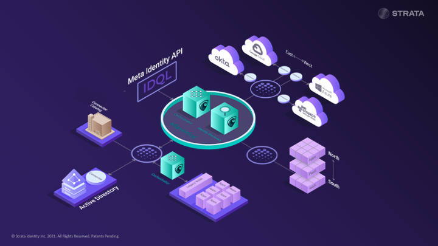
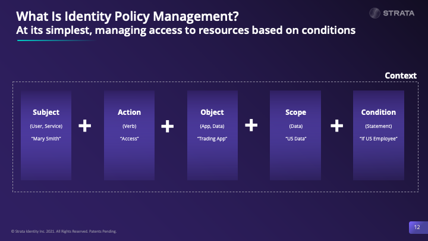

# IDQL Specifications Project

This is the repository for the development of IDQL Policy Language. 

## Introduction

IDQL's objective is to standardize access policy and associated APIs across the cloud and the stack usable in 
standalone deployments all the way to hybrid multi-cloud scenarios.

Quick link to [IDQL specifications](Hexa-IDQL-specification.md).

## Why Is IDQL Needed?
IDQL's goal is intended to address the following issues:
* Multi-cloud access policy does not exist;
* Incumbent vendors are not motivated to address multi-cloud challenges in the absense of a standard;
* Distributed architectures require policy consistency across disparate platforms, domains and technologies; and,
* A standard will provide improved consistency, risk control while avoiding security silos, greater costs, and lock-in.

## Use Cases for IDQL
IDQL is intended to enable management of the following policy scenarios where policy may control:
* Which administrators may make changes in the environment;
* What service features, configurations, and even SKUs may be deployed;
* Used to define what applications may be deployed (for example, an admission controller in a
  Kubernetes cluster controls what application tags may be deployed in a cluster);
* Mandate network requirements for an application including restrictions for a
  software defined network (SDNET);
* Configure the authentication requirements for an Identity Provider;
* Operation of a platform service such as an Identity Aware Proxy;
* External access to application endpoints;
* Internal access between micro-services;
* Scoping of information available to an application; and,
* Inform applications what rights a subject has in order to optimize the user interface experience.

## How does IDQL compare to other standards?
* CNCF [Open Policy Agent](https://www.openpolicyagent.org) (OPA) – Focused on K8S cluster management, networking, and 
  microservices. It is expected that IDQL will be supported in OPA by using a set of (tentatively
  planned OPA Rego modules that will be able to interpret IDQL policy directly in OPA Agents.
* CNCF [SPIFFE/Spire](https://spiffe.io) – focused on App to App identity using x509, not end user identity.
* [SAML](https://www.oasis-open.org/committees/tc_home.php?wg_abbrev=security), [OIDC](https://openid.net),[ OAuth](https://tools.ietf.org/wg/oauth/) are all protocols for SSO and Authorization but not end user identity policy.
* [XACML](https://www.oasis-open.org/committees/tc_home.php?wg_abbrev=xacml) (OASIS) – focused on fine-grained 
  entitlements not end user identity policy. Not declarative, requires custom code and is too complex.

## Getting Started

IDQL Policy is a series of meta statements that define simple policy rules that are then translated and deployed to 
the correct cloud providers, layers and components. A basic statement consists of a `Subject` + `Action` + target 
`Object` + `condition`.

The [IDQL policy specification](Hexa-IDQL-specification.md) defines a neutral JSON policy rule format. IDQL is a platform-neutral format that 
can be used to collect, analyze, audit, and provision policies.  The format has been tested against 3 broad categories
of policy systems including:

* Classic RBAC systems that use role based groupings to manage access (uses virtualized policy mapping)
* Declarative Policy Language systems that are mapped into IDQL. Examples include Google Bind, and Amazon Cedar.
* IDQL Native Policy decision systems such as implemented with the [Open Policy Agent](https://www.openpolicyagent.org) and the [Hexa OPA Project](https://github.com/hexa-org/policy-opa).

## The Standard Process

We are working with developers and customers to build a set of specifications and open source as part of the Cloud 
Native Computing Foundation. The IDQL Working Group will be responsible for the policy specification 
published on this project. 

## Other links:

* [How to contribute](CONTRIBUTING.md)
* [Code of Conduct](CODE_OF_CONDUCT.md)
* [License](LICENSE)
