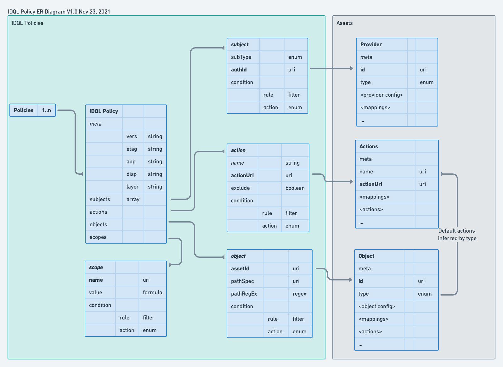

# IDQL Core Specification

This specification defines the IDQL policy language. IDQL is designed to be a general purpose, platform-neutral 
policy language for use in hybrid and multi-cloud environments. IDQL is intended support:
* Centralized management and control of cloud based applications
* A platform-neutral specification that can be mapped into proprietary policy systems or be interpreted directly
* Existing standard schemas where possible.

## Conventions and Terminology

All IDQL specification use a common formatting convention and terminology. For information see [Conventions](Conventions.md).

## Copyright Notice

Copyright (C) 2021, Strata Identity Inc. All rights reserved.

This document is available for use under the APL 2.0 [Apache License](../LICENSE).

## Table of Contents

- [1.0 Introduction](#1.0 Introduction)
- [2.0 YAML and JSON Schema and Media-Types](#2.0 YAML and JSON Schema and Media Types)
- [3.0 Policy and the Project Environment](#3.0 Policy and the Project Environment)
  * [3.1 Identity Providers Types](#3.1 Identity Providers Types)
  * [3.2 Assets](#3.2 Assets)
- [4.0 IDQL Policy Statement](#4.0 IDQL Policy Statement)
  * [4.1 Id Attribute](#4.1 Id Attribute)
  * [4.2 Meta Information](#4.2 Meta Information)
  * [4.3 Subjects](#4.3 Subjects)
  * [4.4 Actions](#4.4 Actions)
  * [4.5 Objects](#4.5 Objects)
  * [4.6 Scopes](#4.6 Scopes)
  * [4.7 Using Conditions](#4.7 Using Conditions)
- [5.0 Evaluation Processing Rules](#5.0 Evaluation Processing Rules)
- [6.0 Deployment Lifecycle](#6.0 Deployment Lifecycle)

---
## 1.0 Introduction
IDQL or IDentity Query Language is a declarative policy language that can be expressed in either
[YAML](https://yaml.org/spec/) 
or [JSON (RFC8259)](https://datatracker.ietf.org/doc/html/rfc8259). IDQL is intended to be used to manage security 
policy in distributed, hybrid [definition?], multi-cloud environments. The intent of IDQL is that all components, of a 
cloud based application from network to application layers may manage access regardless of proprietary platform or 
container. As a declarative policy system IDQL policy may be enforced directly or mapped and converted into 
proprietary platforms that implement IDQL enabled gateways (see: open source project TBD).


>Discussion:  Which parts of IDQL should allow multiples? Multiples enable a single rule to cover more cases.  E.g. 
mulitiple subjects can allow different actors access via the same rule. Issue is that a condition may need to attach 
to a specific source. If we make condition as a separate item, then more complex filters like `(aubject.authId eq 
myGoogleIP and (User:role eq admin))`.  Which pattern is easier to map via the IDQL Gateway? 
> 
> In the current draft, subjects, actions, and objects are each multi-values with each value having a condition attachable.

An IDQL rule defines one or more `subjects` that are permitted one or more `actions` against one or more `objects` with 
an optional set of `scopes`. IDQL may be expressed in YAML or JSON format.

The following shows a policy that users from a provider known as `myGoogleIDP` or entities with an IP address 
matching IP CIDR 192.168.0.1/24 may perform a `createProfile` or `editProfile` action against the target object 
`CanaryProfileService`. The`editProfile` action also 
requires that the value of the variable `adminType` must equal `admincontractor`. The variable `adminType` is set in 
scopes as `admin-contractor` if the subject has an `employeeType` of `contract`.

The YAML representation of an example IDQL policy:
```yaml
---
idql-policies:
- id: CanaryProfileUpdate 
  meta:
    vers: 0.1
    date: 2021-08-01T21:32:44.882Z
    disp: Access policy enabling profile update
    app: CanaryBank1
    layer: User
  subjects:
  - subType: idp
    authId: myGoogleIDP
  - subType: net
    cidr: 192.168.1.0/24
  actions:
  - name: createProfile
    actionUri: https:POST:/Users/
  - name: editProfile
    actionUri: https:PUT|PATCH:/Users/*
    condition:
      rule: adminType eq admincontractor
  objects:
  - assetId: CanaryProfileService
    pathSpec: /Profile/*
  scopes:
  - name: adminType
    value: admin-contractor
    condition:
      rule: User:employeeType eq contract
      action: allow
```

The JSON representation of the YAML policy above:
```json lines
{
  "idql-policies":[
    {
      "id": "CanaryProfileUpdate",
      "meta": {
        "vers": "0.1",
        "date": "2021-08-01T21:32:44.882Z",
        "disp": "Access policy enabling profile update",
        "app": "CanaryBank1",
        "layer": "User"
      },
      "subjects": [
        {
          "subType": "idp",
          "authId": "myGoogleIDP"
        },
        {
          "subType": "net",
          "cidr": "192.168.1.0/24"
        }
      ],
      "actions": [
        {
          "name": "createProfile",
          "actionUri": "https:POST:/Users/"
        },
        {
          "name": "editProfile",
          "actionUri": "https:PUT|PATCH:/Users/*",
          "condition": {
            "rule": "adminType eq admincontractor"
          }
        }
      ],
      "objects": [
        {
          "assetId": "CanaryProfileService",
          "pathSpec": "/Profile/*"
        }
      ],
      "scopes": [
        {
          "name": "adminType",
          "value": "admin-contractor",
          "condition": {
            "rule": "User:employeeType eq contract",
            "action": "allow"
          }
        }
      ]
    }
  ]
}
```

-------

> DISCUSS: Below is an alternative which more closely matches the initial IDQL proposals (condition is top level and 
subject etc. is singular). In this case, a single policy rule becomes 4 because there are two subject types and two 
actions where one action has a condition. In the following example, actions is still plural but all actions must 
> have the same conditions.
> 
> The trade-off is that in the form below, more rules are needed but the processing may be somewhat easier to 
> process. It may also be easier in deployment to figure out which rules go with which assets and can then be sorted 
> by Identity Provider within that asset context.
```yaml
---
idql-policies:
- id: CanaryProfileGoogleUpdate
  meta:
    vers: 0.1
    date: 2021-08-01T21:32:44.882Z
    disp: Access policy enabling profile update for Google users
    app: CanaryBank1
    layer: User
  subject:
    subType: idp
    authId: myGoogleIDP
  actions:
    - name: createProfile
      actionUri: https:POST:/Users/
  object:
    - assetId: CanaryProfileService
      pathSpec: /Profile/*
- id: EditProfileGoogleUpdate AdminContractor
  meta:
    vers: 0.1
    date: 2021-08-01T21:32:44.882Z
    disp: Access policy enabling profile update for Google users
    app: CanaryBank1
    layer: User
  subject:
    subType: idp
    authId: myGoogleIDP
  actions:
    - name: editProfile
      actionUri: https:PUT|PATCH:/Users/*
  object:
    - assetId: CanaryProfileService
      pathSpec: /Profile/*
  condition:
    rule: User:employeeType eq contract
    action: allow
- id: CanaryProfileInternalNetUpdate
  meta:
    vers: 0.1
    date: 2021-08-01T21:32:44.882Z
    disp: Access policy enabling profile update for internal network clients
    app: CanaryBank1
    layer: Services
  subject:
    subType: net
    cidr: 192.168.1.0/24
  actions:
  - name: createProfile
    actionUri: https:POST:/Users/
  object:
  - assetId: CanaryProfileService
    pathSpec: /Profile/*
- id: EditProfileInternalNetUpdate
  meta:
    vers: 0.1
    date: 2021-08-01T21:32:44.882Z
    disp: Access policy enabling profile update for internal network clients
    app: CanaryBank1
    layer: Services
  subject:
    subType: net
    cidr: 192.168.1.0/24
  actions:
    - name: editProfile
      actionUri: https:PUT|PATCH:/Users/*
  object:
    - assetId: CanaryProfileService
      pathSpec: /Profile/*
  condition:
    rule: User:employeeType eq contract
    action: allow        
```
----

## 2.0 YAML and JSON Schema and Media Types

IDQL MAY be expressed in either [YAML](https://yaml.org) or 
[JSON (RFC8259)](https://datatracker.ietf.org/doc/html/rfc8259) form. This specification uses the 
[JSON Schema Specification](https://json-schema.org) to formalize its [format](../schema/idql-policy.schema.json) for 
validation purposes.  

The media type for IDQL YAML is `application/idql+yaml` and `application/idql+json` for JSON formatted content. 

>TODO: write and submit IANA registrations for application/idql+json and application/idql+yaml.  Note: `text/yaml` 
though popular is not formally defined. `text` media type is intended for unstructured textual data.  See Sec 4.2.1 
and 4.2.5 of RFC6838.

---
## 3.0 Policy and the Project Environment

IDQL requires a project configuration information that provides the data upon which IDQL rules
may operate. 
* _Identity Providers_ defines the `subjects` that MAY be defined in IDQL including provider type (SAML, OIDC, 
etc.), their source, and claims available for use in policy rules.
* _Assets_ are platforms, components, and services where policy may be potentially assigned. Typically, an asset will 
  have a set of permissible `actions` that allowed, denied, and/or scoped in a IDQL policy rule. 
 
In cloud native environments, policy decision and enforcement may occur using different models. Policy deployment, 
processing (deicisons) and enforcement may be local to the asset (e.g. using the 
[Open Poilicy Agent sidecar pattern](https://www.openpolicyagent.org/docs/latest/integration/#comparison)), 
delivered through a shared service Policy Decision Point (PDP), or handled directly through a platform's administrative 
interfaces, or other method. As a declarative policy system, it is assumed that the policy administrative gateway 
services for IDQL will handle delivery and configuration with the defined policy assets. _[is this needed?]_

The following figure shows the relationship between asset properties and IDQL policy. In the box on the left, a 
single JSON file can contain one or more policies. Each policy references Providers and Objects stored in `Assets` 
on the right. The `Assets` data contains all the necessary information to allow a Policy Gateway to deploy and 
configure IDQL policy with thin the designated target. In addition to providing provisioning details, the Assets 
also provide details on the attributes or schema available to IDQL policy.



### 3.1 Identity Providers Types

>TODO: Does type matter in IDQL? Should "anonymous" be distinct from Any? What is the default position of policy - 
deny unless permitted?

Providers are declared defined in a configuration system or file and are identified by an `authId` in IDQL which 
SHOULD match a defined provider. Declaration for defined providers SHOULD provide the context which enables IDQL to 
match subjects in its policies. In addition to having an `authId`, each provider source should have a standard or 
configured set of claims which may be used in policy conditions. Where possible, claims from Identity Providers 
should be mapped to the JSON based [SCIM User schema under IANA](https://www.iana.org/assignments/scim/scim.xhtml).

#### Identity Provider Attributes

In addition to Identity Provider claims or attributes, the following attributes MAY be used in relation to an 
authenticated subject:
* `subject.authId` - The identifier for the provider under which the subject was authenticated.
* `subject.http` - To access HTTP request information.
  * `header.<header-name>` - May be used to compare the value of a particular http header. If multiple headers of 
    the same name exists, then the value is considered muli-valued. Any comparison that matches a single-value SHALL 
    be considered a match. For example `subject.http.header.authorization sw bearer`.
  * `ip` - The IP address of the requestor.
  * `method` - The HTTP Method used to make the request (e.g. GET, POST, DELETE, PUT, PATCH).
  * `param.<name>` - Returns the value of any request parameter in the URI following and separated by the ampersand 
    (&). If a parameter is repeated, it is treated as a multi-value for the purposes of filter comparison.
  * `path` - The path portion of the request URI.
  * `protocol` - The protocol portion of the request URI (e.g. HTTP).
  * `query` - Returns any information contained after a `?` in a request URI.
  
* `subject.jwt.<claim>` - If a JWT was used, specific claims can be compared where <claim> is the name of a claim. For 
  example `subject.jwt.iss eq my.example.com`
* `subject.roles` - Roles mapped by the provider to the subject if any.
* `subject.saml.<claim>` - If a SAML assertion was used, specific claims can be compared. For example `subject.saml.iss eq my.example.com`
* `subject.prov.<name>` - Provider specific attributes related to a subject may be accessed using the `subject.prov` 
  prefix combined with a `<name>` for the provider specific attribute or claim.

Provider configuration data may be accessed using `provider.<authId>.<name>` where `<authId>` is the authId identifier 
of the configured provider and `<name>` is a configuration parameter name.

See [IDQL Providers Specification](IDQL-providers.md) for information on subject provider configuration.

### 3.2 Assets
Each asset referred to in an IDQL policy uses an assetId identifier. The information on the location and other data 
about that asset is contained within an asset inventory. This information includes the type of asset which further 
defines how policy is mapped and deployed for the asset. For more information see: 
[IDQL Assets Specification](IDQL-assets.md).

> DISCUSS: It is assumed that the type of asset and its configuration determines the actions that are available. 
> Does this matter to the IDQL specification?

----
## 4.0 IDQL Policy Statement

An IDQL policy statement consists of the following attributes:
* `id` - An OPTIONAL unique attribute for the policy statement
* `meta` - Metadata about the policy including versioning and descriptions
* `subjects` - An array of subjects that this policy is applied to. 
* `actions` - Actions that MAY be performed or excluded
* `objects` - The assets against which policy is applied to.
* `scopes` - Defines attributes which may be used as additional qualifiers against subjects, actions, actions, or in 
  conditions applied to policy.

### 4.1 Id Attribute

* `id` - A policy `id` is a unique identifier string that allow individual policies to be referenced and potentially 
  indicate purpose. An `id` MAY be a [GUID](https://en.wikipedia.org/wiki/Universally_unique_identifier) or 
  simply a unique textual identifier assigned by an administrator.

### 4.2 Meta Information

The IDQL `meta` attribute is a top level policy object containing attributes for versioning and information 
organization and versioning. All meta attributes are OPTIONAL.

```yaml 
idql-policies:
- id: example-policy
  meta:
    vers: 0.1
    date: 2021-08-01T21:32:44.882Z
    etag: e180ee84f0671b1
    disp: Access policy enabling profile update
    app: CanaryBank1
    layer: external-access
  subjects:
    . . .
  actions:
    . . .
  objects:
    . . .
```

Versioning attributes include:
* `date` - A modification date expressed in `DateTime` format. Value MUST be encoded as a valid `xsd:dateTime` 
  as specified in Section 3.3.7 of XML XSD Definitions 
  [[W3C XML Schema Definition Language(XSD) 1.1 Part2: Data Types]](http://www.w3.org/TR/xmlschema11-2/) 
  and MUST include both a date and a time. A `date` SHALL have no case sensitivity or uniqueness.
* `vers` - A version identifier used to distinguish different policy versions (e.g. 1.0.1)
* `etag` - A hash value of the current policy statement per 
  [Section 2.3 of RFC7232](https://datatracker.ietf.org/doc/html/rfc7232#section-2.3). This value is often used as a 
  request pre-condition to ensure a policy being updated has not already been altered.

Informational attributes include:
* `app` - An OPTIONAL string identifier that may be used to group policy statments pertaining to a common application.
* `disp` - An OPTIONAL string containing a description of the intent of the policy.
* `layer` - An OPTIONAL string identifier that may be used to group policy statements in a common container or 
  application layer.

### 4.3 Subjects

`subjects` when provided, is an array of one or more Identity Provider sources as defined below. If 
subjects is not present, the policy rule SHALL be applied to all requests, regardless of authentication status (e.g. HTTP authorization is ignored).
```yaml
idql-policies:
- id: example-policy
  meta:
    . . .
  subjects:
  - subType: idp
    authId: myGoogleIDP
  - subType: net
    cidr: 192.168.1.0/24
  actions:
    . . .
  objects:
    . . .
```
A subject value is an object consisting of the following attributes:
* `condition` - An OPTIONAL condition clause which MAY be used for matching purposes. See 
  [Section 4.7 Using Conditions](#4.7 Using Conditions).
* `subType` - A text value indicating the type of subject provider being referenced. Supported values include:
 
  * `any` - Any subject whether authenticated or anonymous
  * `auth` - Any authenticated subject using any Identity Provider
  * `basic` - A subject authenticated using [HTTP Basic Auth (RFC7617)](https://datatracker.ietf.org/doc/html/rfc7617).
  * `jwt` - A subject that is authenticated by validating a
    [JWT token (RFC7519, RFC8725)](https://datatracker.ietf.org/doc/html/rfc8725) issued by an [OAuth2 Authorization
    Server (RFC6749)](https://datatracker.ietf.org/doc/html/rfc6749).
  * `op` - A subject authenticated with a JWT token issued by an [OpenID Provider](https://openid.net).
  * `saml` - A subject authenticated with an XML SAML assertion using a SAML IDP.
  * `ref` - Allows a rule scoped to a specific URI to be applied. E.g. it could be a specific subject from a JWT token.
  * `net` - A subject identified by the client requestor's network address expressed as an IP address or 
    [CIDR (RFC1817)](https://datatracker.ietf.org/doc/html/rfc1817) value. 
    Used for access control for internal services.
  * `other` - A custom provider _[TODO: do we need this?]_

When `subType` is one of: `basic`, `jwt`, `op`, `saml`, or `other`, the attribute `authId` specifies the identifier of an Identity 
Provider configured as part of the policy project assets.

When `subType` is `ref`, an attribute of `ref` is used to identify a URI for matching a subject. The process for which 
matching occurs is not defined by this specification.

When `subType` is `net`, an attribute of `cidr` is used to specify an IP Address or network mask (CIDR).

### 4.4 Actions
Actions describe the request operations that may be performed at a particular service Object. If no actions are 
specified, it SHALL be assumed that the rule permits all actions. Actions can be logical (such as a scope) or a 
filter that compares protocol, method, and path.

```yaml
idql-policies:
- id: example-policy
  meta:
    . . .
  subjects:
    . . .
  actions:
  - name: createProfile
    actionUri: https:POST:/Users/
  - name: editProfile
    actionUri: https:PUT|PATCH:/Users/*
    condition:
      rule: adminType eq admincontractor
  objects:
    . . .
```
 
An action consists of the following attributes:
* `name` - An OPTIONAL unique identifier for an action.
* `actionUri` - A URI of the form `<domain>:<protocol>:<method>:<pathSpec>?<param-qual>` where
  * `<domain>` - Is the defining domain for the action. E.g. `ietf`, `arn`, `gcp`, `azure`. For `aws`, use the AWS
    `arn` format. For `ietf` protocols the
    following apply:
    * `<protocol>` - Is the applicaiton protocol (e.g. FTP, HTTP, IMAP)
    * `<method>` - An associated method if any. Multiple methods may be specified using the `|` (e.g. PUT|PATCH).
    * `<pathSpec>` - A URI file path which MAY include a wildcard (`*`). For example: `/Users/*`.
* `exclude` - When set to true, the action MAY be used to invert the action. For example, everything is permitted 
  except for `https:PUT|PATCH|DELETE:/*`
* `condition` - An action MAY have a matching condition applied. See
  [Section 4.7 Using Conditions](#4.7 Using Conditions).

URIs and paths may contain wildcards (`*`) and may contain
variables denoted by `${<variable>}` where <variable> is the variable name (e.g. calculated by a scope).

>TODO: Should we have multiple URI types specified?  E.g.  actions that match to roles?

### 4.5 Objects

Objects are assets in a project which are protected by policy. Objects are an identified asset combined with a path 
specification.

```yaml
idql-policies:
- id: example-policy
  meta:
    . . .
  subjects:
    . . .
  actions:
    . . .
  objects:
  - assetId: CanaryProfileService
    pathSpec: /Profile/${User:username}
```

An object consists of the following attributes:
* `assetId` - A unique URI that points to an asset where policy is to be applied.
* `pathSpec` - A string representing a path or path filter including wildcards or variables. A path may contain wildcards (`*`) and may contain
  variables denoted by `${<variable>}` where <variable> is the variable name (e.g. calculated by a scope).
* `pathRegEx` - A [Regular Expression](https://en.wikipedia.org/wiki/Regular_expression) used for matching request paths.
* `condition` - An object MAY have a matching condition applied. See
  [Section 4.7 Using Conditions](#4.7 Using Conditions).

### 4.6 Scopes

Scopes are used to define variables which may be used in `conditions` and paths in `actions` and `objects`.

Scope variables may also be returned to applications instead of an allow/deny boolean response.  
_[TODO: How is this expressed?]_

```yaml
idql-policies:
- id: example-policy
  meta:
    . . .
  subjects:
    . . .
  actions:
    . . .
  objects:
  - assetId: CanaryProfileService
    pathSpec: /Profile/*
  scopes:
  - name: adminType
    value: admin-contractor
    condition:
      rule: User:employeeType eq contract
      action: allow
  - name: workCountry
    value: ${Users:addresses[type eq work].country}
```

A scope consists of the following attributes:
* `name` - The name of a variable to define. Scope name values SHOULD avoid naming conflicts with other attribute 
  sources. In the event of a name conflict, the name defined in scope SHALL take precedence.
* `value` - The value to be assigned. The value may be a static string or integer, or may be a string using variable 
  substitution denoted by `${<variable>}` where <variable> is the variable name.  For example: `"admin-${User:employeeType}"`
_[TODO: should multi-value and other types be allowed? E.g. use square brackets?]_
* `condition` - An scope MAY have a matching condition applied. See
  [Section 4.7 Using Conditions](#4.7 Using Conditions).

Note in the above scope example:
* workCountry is a scope variable `workCountry` that is defined as the employee's work
address. The qualifier `[type eq work]` selects the work address value from the multi-valued attribute `addresses` and
assigns the value of sub-attribute `country`.
* `adminType` is assigned `admin-contractor` if the User's `employeeType` attribute is equal to `contract`.

### 4.7 Using Conditions
An IDQL condition can be applied to `subjects`, `actions`, `objects`, and `scopes`. Conditions are used to qualify whether a 
subject, action, or object is to be applied, or in the case of a scope, whether an attribute is to be assigned.

```yaml
idql-policies:
- id: example-policy
  meta:
    . . .
  subjects:
  - subType: idp
    authId: myGoogleIDP
    condition:
      rule: subject.jwt.iss eq oidc.strata.io
      action: allow
  actions:
  - name: createProfile
    actionUri: https:POST:/Users/
  - name: editProfile
    actionUri: https:PUT|PATCH:/Users/*
    condition:
      rule: adminType eq admincontractor
      action: deny
  objects:
    . . .
```

A condition has two attributes:
* `rule` - A matching filter that uses a SCIM filter value as specified in Section
  [3.4.2.2 of RFC7644](https://datatracker.ietf.org/doc/html/rfc7644#section-3.4.2.2). In addition to using SCIM 
  attribute names for User objects, each provider and object may define additional attributes that MAY be used 
  during policy evaluation. These may be referred to by their simple name. Scope attribute names MAY also be 
  referred to by their name. For example: `User:employeeType eq contract`. Filter values MAY be URL-encoded per 
  [Section 2.1 of RFC3986](https://datatracker.ietf.org/doc/html/rfc3986#section-2.1).
* `action` - Indicates the desired effect of the condition which may be:
  * `allow` - Proceeds if there is a match. Allow is the default.
  * `deny` - Negates the outcome if there is a match.
  * `audit` - The rule is not enforced, but processing outcome is logged. 
  * `disabled` - The condition is ignored. _[TODO: How does this impact matching?]_

---
## 5.0 Evaluation Processing Rules

_What happens when no values provided for subjects/actions/objects?_

_What happens when multiple values are provided for subjects/actions/objects?_

_In the absense of matches deny is always the default._

Deny always supersedes Allow.  With no permissive rule, deny is the default response.

---
## 6.0 Deployment Lifecycle

_[TODO: Define a typical lifecycle. Does this belong here?]_