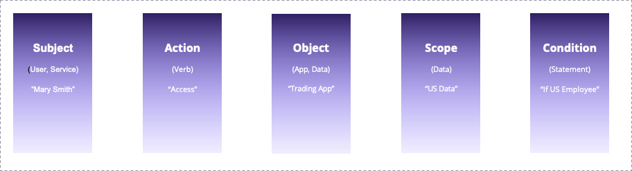

# IDQL Core Specification

This specification defines the IDQL policy language. IDQL is designed to be a general purpose, platform-neutral 
policy language for use in hybrid and multi-cloud environments. IDQL is intended support:
* Centralized management and control of cloud based applications
* A platform-neutral specification that can be mapped into proprietary policy systems or be interpreted directly
* Existing standard schemas where possible.

## Conventions and Terminology

All IDQL specification use a common formatting convention and terminology. For information see [Conventions](Conventions.md).

## Copyright Notice

Copyright (C) 2021, Strata Identity Inc. All rights reserved.

This document is available for use under the APL 2.0 [Apache License](../LICENSE).

## Table of Contents

* [1.0 Introduction](#1.0 Introduction)
* [2.0 YAML and JSON Schema and Media-Types](#2.0 YAML and JSON Schema and Media Types)
* [3.0 Policy and the Policy Gateway](#3.0 Policy and the Policy Gateway)
  * [3.1 Identity Provider Attributes](#3.1 Identity Provider Attributes)
* [4.0 IDQL Policy Statements](#4.0 IDQL Policy Statements)
  * [4.1 Id Attribute](#4.1 Id Attribute)
  * [4.2 Meta Information](#4.2 Meta Information)
  * [4.3 Subject](#4.3 Subject)
  * [4.4 Actions](#4.4 Actions)
  * [4.5 Object](#4.5 Object)
  * [4.6 Scopes](#4.6 Scopes)
  * [4.7 Condition](#4.7 Condition)
* [5.0 Evaluation Processing Rules](#5.0 Evaluation Processing Rules)
* [6.0 Deployment Lifecycle](#6.0 Deployment Lifecycle)

---
## 1.0 Introduction
IDQL or IDentity Query Language is a declarative policy language that can be expressed in either
[YAML](https://yaml.org/spec/) 
or [JSON (RFC8259)](https://datatracker.ietf.org/doc/html/rfc8259). IDQL is intended to be used to manage security 
policy in distributed, hybrid [definition?], multi-cloud environments. The intent of IDQL is that all components, of a 
cloud based application from network to application layers may manage access regardless of proprietary platform or 
container. As a declarative policy system IDQL policy may be enforced directly or mapped and converted into 
proprietary platforms that implement IDQL enabled gateways (see: open source project TBD).



An IDQL policy rule identifies a `subject` provider that is permitted one or more `actions` against a target `object` 
with an OPTIONAL set of `scopes` that MAY be used in a condition or returned to the target (e.g. dataSet = "US"). 
IDQL policy MAY be expressed in YAML or JSON format.

IDQL is intended to be used with an [IDQL Policy Gateway API] (the "Gateway") which enables retrieval of deployment 
environments and the ability to retireve, update, and provision policy. The Gateway defines identifiers for the assets referred to in 
IDQL policy such as: 
* `provId` - The identifier of an Identity Provider (e.g. "myGoogleIDP") that will provide the "subjects" referred to in 
  the policy.
* `assetId` - The identifier of a service or entity where policy is deployed (e.g. "CanaryProfileService").

### Example IDQL Policy

The following shows a policy that users from a provider known as "myGoogleIDP" or entities with an IP address 
matching IP CIDR 192.168.0.1/24 may perform a `createProfile` or `editProfile` action against the target object 
`CanaryProfileService`. When from "myGoogleIDP" The`editProfile` action also 
requires that the User `employeeType` be equal to `contract`. 
> Discussion: User:employeeType eq contract is essentially an implied role based on a condition of the user. This 
> may be pre-assigned by the IDP, or be tested at the PDP. 

The YAML representation of an example IDQL policy:
```yaml
---
idql-policies:
- id: CanaryProfileGoogleUpdate
  meta:
    vers: 0.1
    date: 2021-08-01T21:32:44.882Z
    disp: Access policy enabling profile update for Google users
    app: CanaryBank1
    layer: User
  subject:
    subType: op
    provId: myGoogleIDP
  actions:
    - name: createProfile
      actionUri: https:POST:/Users/
  object:
    assetId: CanaryProfileService
    pathSpec: /Profile/*
  condition:
    role: canaryAccountCreator
- id: EditProfileGoogleUpdate AdminContractor
  meta:
    vers: 0.1
    date: 2021-08-01T21:32:44.882Z
    disp: Access policy enabling profile update for Google users
    app: CanaryBank1
    layer: User
  subject:
    subType: op
    provId: myGoogleIDP
  actions:
    - name: editProfile
      actionUri: https:PUT|PATCH:/Users/*
  object:
    assetId: CanaryProfileService
    pathSpec: /Profile/*
  condition:
    rule: User:employeeType eq contract
    action: allow
- id: CanaryProfileInternalNetUpdate
  meta:
    vers: 0.1
    date: 2021-08-01T21:32:44.882Z
    disp: Access policy enabling profile update for internal network clients
    app: CanaryBank1
    layer: Services
  subject:
    subType: net
    cidr: 192.168.1.0/24
  actions:
  - name: createProfile
    actionUri: https:POST:/Users/
  - name: editProfile
    actionUri: https:PUT|PATCH:/Users/*
  object:
    assetId: CanaryProfileService
    pathSpec: /Profile/*   
```

The JSON representation of the YAML policy above:
```json lines
{
  "idql-policies": [
    {
      "id": "CanaryProfileGoogleUpdate",
      "meta": {
        "vers": "0.1",
        "date": "2021-08-01 21:32:44 UTC",
        "disp": "Access policy enabling profile update for Google users",
        "app": "CanaryBank1",
        "layer": "User"
      },
      "subject": {
        "subType": "op",
        "provId": "myGoogleIDP"
      },
      "actions": [
        {
          "name": "createProfile",
          "actionUri": "https:POST:/Users/"
        }
      ],
      "object": {
        "assetId": "CanaryProfileService",
        "pathSpec": "/Profile/*"
      },
      "condition" : {
        "role": "canaryAccountCreator"
      }
    },
    {
      "id": "EditProfileGoogleUpdate AdminContractor",
      "meta": {
        "vers": "0.1",
        "date": "2021-08-01 21:32:44 UTC",
        "disp": "Access policy enabling profile update for Google users",
        "app": "CanaryBank1",
        "layer": "User"
      },
      "subject": {
        "subType": "op",
        "provId": "myGoogleIDP"
      },
      "actions": [
        {
          "name": "editProfile",
          "actionUri": "https:PUT|PATCH:/Users/*"
        }
      ],
      "object": {
        "assetId": "CanaryProfileService",
        "pathSpec": "/Profile/*"
      },
      "condition": {
        "rule": "User:employeeType eq contract",
        "action": "allow"
      }
    },
    {
      "id": "CanaryProfileInternalNetUpdate",
      "meta": {
        "vers": "0.1",
        "date": "2021-08-01 21:32:44 UTC",
        "disp": "Access policy enabling profile update for internal network clients",
        "app": "CanaryBank1",
        "layer": "Services"
      },
      "subject": {
        "subType": "net",
        "cidr": "192.168.1.0/24"
      },
      "actions": [
        {
          "name": "createProfile",
          "actionUri": "https:POST:/Users/"
        },
        {
          "name": "editProfile",
          "actionUri": "https:PUT|PATCH:/Users/*"
        }
      ],
      "object": {
        "assetId": "CanaryProfileService",
        "pathSpec": "/Profile/*"
      }
    }
  ]
}
```
----

## 2.0 YAML and JSON Schema and Media Types

IDQL MAY be expressed in either [YAML](https://yaml.org) or 
[JSON (RFC8259)](https://datatracker.ietf.org/doc/html/rfc8259) form. This specification uses the 
[JSON Schema Specification](https://json-schema.org) to formalize its [format](../schema/idql-policy.schema.json) for 
validation purposes.  

The media type for IDQL YAML is `application/idql+yaml` and `application/idql+json` for JSON formatted content. 

>TODO: write and submit IANA registrations for application/idql+json and application/idql+yaml.  Note: `text/yaml` 
though popular is not formally defined. `text` media type is intended for unstructured textual data.  See Sec 4.2.1 
and 4.2.5 of RFC6838.

---
## 3.0 Policy and the Policy Gateway

IDQL requires a project configuration information that provides the data upon which IDQL rules
may operate. The Policy Gateway provides the following objects
* _Identity Providers_ define `provId` identifiers which define the `subjects` that MAY be defined in IDQL including 
  provider type (SAML, OIDC, etc.), their source, and claims available for use in policy rules. Each provider SHOULD 
  have a set of claims which may be used in policy conditions. Where possible, claims from Identity Providers
  should be mapped to claims defined by [OpenID Connect](https://openid.net/specs/openid-connect-core-1_0.
  html#Claims). For extended User profile attributes, use 
  [SCIM User schema under IANA](https://www.iana.org/assignments/scim/scim.xhtml).
* _Assets_ identified by `assetId` are platforms, components, and services where policy may be potentially assigned. 
  Typically, an asset will 
  have a set of permissible `actions` that allowed, denied, and/or scoped in a IDQL policy rule. 
 
In practice, the Policy Gateway is responsible for mapping IDQL Policy to each platform and its native policy system.
In different cloud native environments, policy decision and enforcement may occur using different models. Policy 
deployment, processing (deicisons) and enforcement may be local to the asset (e.g. using the 
[Open Poilicy Agent sidecar pattern](https://www.openpolicyagent.org/docs/latest/integration/#comparison)), 
delivered through a shared service Policy Decision Point (PDP), or handled directly through a platform's administrative 
interfaces, or other method. As a declarative policy system, it is assumed that the policy administrative gateway 
services for IDQL will handle delivery and configuration with the defined policy assets.


### 3.1 Identity Provider Attributes

In addition to Identity Provider claims or attributes, the following attributes MAY be used in relation to an 
authenticated subject:
* `subject.provId` - The identifier for the provider under which the subject was authenticated.
* `req` - To access request context information
  * `ip` - The IP address of the requestor.
  * `protocol` - The protocol portion of the request URI (e.g. HTTP).
  * `time` - The time of the client request
  * `param.<name>` - Returns the value of any request parameter in the URI following and separated by the ampersand
    (&). If a parameter is repeated, it is treated as a multi-value for the purposes of filter comparison.
  * `uri` - The full request URI sent by the client.
  * `path` - The path portion of the request URI.
  * `query` - Returns any information contained after a `?` in a request URI.
  * `http` - To access HTTP request information.
    * `header.<header-name>` - May be used to compare the value of a particular http header. If multiple headers of 
      the same name exists, then the value is considered muli-valued. Any comparison that matches a single-value SHALL 
      be considered a match. For example `req.http.header.authorization sw bearer`.
    * `method` - The HTTP Method used to make the request (e.g. GET, POST, DELETE, PUT, PATCH).
  
* `subject.jwt.<claim>` - If a JWT was used, specific claims can be compared where <claim> is the name of a claim. For 
  example `subject.jwt.iss eq my.example.com`
* `subject.roles` - Roles mapped by the provider to the subject if any.
* `subject.saml.<claim>` - If a SAML assertion was used, specific claims can be compared. For example `subject.saml.iss eq my.example.com`
* `subject.prov.<name>` - Provider specific attributes related to a subject may be accessed using the `subject.prov` 
  prefix combined with a `<name>` for the provider specific attribute or claim.

Provider configuration data may be accessed using `provider.<provId>.<name>` where `<provId>` is the provId identifier 
of the configured provider and `<name>` is a configuration parameter name.

See [IDQL Providers Specification](IDQL-providers.md) for information on subject provider configuration.

----
## 4.0 IDQL Policy Statements

A set of IDQL Policy Statements is contained in an array of `idql-policies` which contains 1 or more IDQL "Policy 
statements".

Each Policy Statement consists of the following attributes:
* `id` - An OPTIONAL unique attribute for the policy statement
* `meta` - Metadata about the policy including versioning and descriptions
* `subject` - A subject identifying the actors a policy is applied to. 
* `actions` - A set of actions that MAY be performed or excluded
* `object` - The target assets against which policy is applied.
* `scopes` - Defines attributes which may be used as additional qualifiers against subjects, actions, actions, or in 
  conditions applied to policy.
* `condition` - An OPTIONAL condition that specifies either a `rule` or `role` for which the policy applies.

### 4.1 Id Attribute

* `id` - A policy `id` is a unique identifier string that allow individual policies to be referenced and potentially 
  indicate purpose. An `id` MAY be a [GUID](https://en.wikipedia.org/wiki/Universally_unique_identifier) or 
  simply a unique textual identifier assigned by an administrator.

### 4.2 Meta Information

The IDQL `meta` attribute is a top level policy object containing attributes for versioning and information 
organization and versioning. All meta attributes are OPTIONAL.

```yaml 
idql-policies:
- id: example-policy
  meta:
    vers: 0.1
    date: 2021-08-01T21:32:44.882Z
    etag: e180ee84f0671b1
    disp: Access policy enabling profile update
    app: CanaryBank1
    layer: external-access
  subjects:
    . . .
  actions:
    . . .
  objects:
    . . .
```

Versioning attributes include:
* `date` - A modification date expressed in `DateTime` format. Value MUST be encoded as a valid `xsd:dateTime` 
  as specified in Section 3.3.7 of XML XSD Definitions 
  [[W3C XML Schema Definition Language(XSD) 1.1 Part2: Data Types]](http://www.w3.org/TR/xmlschema11-2/) 
  and MUST include both a date and a time. A `date` SHALL have no case sensitivity or uniqueness.
* `vers` - A version identifier used to distinguish different policy versions (e.g. 1.0.1)
* `etag` - A hash value of the current policy statement per 
  [Section 2.3 of RFC7232](https://datatracker.ietf.org/doc/html/rfc7232#section-2.3). This value is often used (e.g.
  [Google Cloud Policy](https://cloud.google.com/iam/docs/policies#etag)) as a 
  request pre-condition to ensure a policy being updated has not already been altered by another entity 
  (administrative system).

Informational attributes include:
* `app` - An OPTIONAL string identifier that may be used to group policy statments pertaining to a common application.
* `disp` - An OPTIONAL string containing a description of the intent of the policy.
* `layer` - An OPTIONAL string identifier that may be used to group policy statements in a common container or 
  application layer.


### 4.3 Subject

The `subject` indicates a method or Identity Provider to identify a security entity invoking a request.
If subject is not present, the policy rule is applied to all requests, regardless of authentication 
status (e.g. HTTP authorization is ignored).
```yaml
idql-policies:
- id: example-policy
  meta:
    . . .
  subject:
    subType: idp
    provId: myGoogleIDP
  actions:
    . . .
  objects:
    . . .
```
A subject value is an object consisting of the following attributes:
* `subType` - A text value indicating the type of subject provider being referenced. Supported values include: 
  * `any` - Any subject whether authenticated or anonymous (this is the same is not specifying a subject)
  * `auth` - Any authenticated subject using any Identity Provider
  * `basic` - A subject authenticated using [HTTP Basic Auth (RFC7617)](https://datatracker.ietf.org/doc/html/rfc7617).
  * `jwt` - A subject that is authenticated by validating a
    [JWT token (RFC7519, RFC8725)](https://datatracker.ietf.org/doc/html/rfc8725) issued by an [OAuth2 Authorization
    Server (RFC6749)](https://datatracker.ietf.org/doc/html/rfc6749).
  * `op` - A subject authenticated with a JWT token issued by an [OpenID Provider](https://openid.net).
  * `saml` - A subject authenticated with an XML SAML assertion using a SAML IDP.
  * `net` - A subject identified by the client requestor's network address expressed as an IP address or 
    [CIDR (RFC1817)](https://datatracker.ietf.org/doc/html/rfc1817) value. 
    Used for access control for internal services.
  * `other` - A custom provider _[TODO: do we need this?]_

When `subType` is one of: `basic`, `jwt`, `op`, `saml`, or `other`, the attribute `provId` specifies the identifier of an Identity 
Provider configured as part of the policy project assets.
> Discuss:  do we need `subType`?  Can be inferred by the use of provId vs other attributes like `cidr`.

When `subType` is `net`, an attribute of `cidr` is used to specify an IP Address or network mask (CIDR).

### 4.4 Actions
Actions describe the request operations that may be performed at a particular service Object. If no actions are 
specified, it SHALL be assumed that the rule permits all actions. Actions can be logical (such as a scope) or a 
filter that compares protocol, method, and path.

```yaml
idql-policies:
- id: example-policy
  meta:
    . . .
  subjects:
    . . .
  actions:
  - name: createProfile
    actionUri: https:POST:/Users/
  - name: editProfile
    actionUri: https:PUT|PATCH:/Users/*
    condition:
      rule: adminType eq admincontractor
  objects:
    . . .
```
> TODO:  Need a couple example URIs from Google, AWS, Azure.

An action consists of the following attributes:
* `name` - An OPTIONAL unique identifier for an action.
* `actionUri` - A URI of the form `<domain>:<protocol>:<method>:<pathSpec>?<param-qual>` where
  * `<domain>` - Is the defining domain for the action. E.g. `ietf`, `arn`, `gcp`, `azure`. For `aws`, use the AWS
    `arn` format. For `ietf` protocols the
    following apply:
    * `<protocol>` - Is the applicaiton protocol (e.g. FTP, HTTP, IMAP)
    * `<method>` - An associated method if any. Multiple methods may be specified using the `|` (e.g. PUT|PATCH).
    * `<pathSpec>` - A URI file path which MAY include a wildcard (`*`). For example: `/Users/*`.
* `exclude` - When set to true, the action MAY be used to invert the action. For example, everything is permitted 
  except for `https:PUT|PATCH|DELETE:/*`

URIs and paths may contain wildcards (`*`) and may contain
variables denoted by `${<variable>}` where <variable> is the variable name (e.g. calculated by a scope).

>TODO: Should we have multiple URI types specified?  E.g.  actions that match to roles?

### 4.5 Object

Objects are assets in a project which are protected by policy. Objects are an identified asset combined with a path 
specification.

```yaml
idql-policies:
- id: example-policy
  meta:
    . . .
  subjects:
    . . .
  actions:
    . . .
  objects:
  - assetId: CanaryProfileService
    pathSpec: /Profile/${User:username}
```

An object consists of the following attributes:
* `assetId` - A unique URI that points to an asset where policy is to be applied.
* `pathSpec` - A string representing a path or path filter including wildcards or variables. A path may contain wildcards (`*`) and may contain
  variables denoted by `${<variable>}` where <variable> is the variable name (e.g. calculated by a scope).
* `pathRegEx` - A [Regular Expression](https://en.wikipedia.org/wiki/Regular_expression) used for matching request paths.

### 4.6 Scopes

Scopes are used to define variables which may be used in `conditions` and paths in `actions` and `objects`.

Scope variables may also be returned to applications instead of an allow/deny boolean response.  
_[TODO: How is this expressed?]_

```yaml
idql-policies:
- id: example-policy
  meta:
    . . .
  subjects:
    . . .
  actions:
    . . .
  objects:
  - assetId: CanaryProfileService
    pathSpec: /Profile/*
  scopes:
  - name: adminType
    value: admin-contractor
    condition:
      rule: User:employeeType eq contract
      action: allow
  - name: workCountry
    value: ${Users:addresses[type eq work].country}
```

A scope consists of the following attributes:
* `name` - The name of a variable to define. Scope name values SHOULD avoid naming conflicts with other attribute 
  sources. In the event of a name conflict, the name defined in scope SHALL take precedence.
* `value` - The value to be assigned. The value may be a static string or integer, or may be a string using variable 
  substitution denoted by `${<variable>}` where <variable> is the variable name.  For example: `"admin-${User:employeeType}"`
_[TODO: should multi-value and other types be allowed? E.g. use square brackets?]_

Note in the above scope example:
* workCountry is a scope variable `workCountry` that is defined as the employee's work
address. The qualifier `[type eq work]` selects the work address value from the multi-valued attribute `addresses` and
assigns the value of sub-attribute `country`.
* `adminType` is assigned `admin-contractor` if the User's `employeeType` attribute is equal to `contract`.

### 4.7 Condition
Conditions are used to qualify whether a subject, action, or object is to be applied. 

```yaml
idql-policies:
- id: example-policy
  meta:
    . . .
  subject:
    subType: idp
    provId: myGoogleIDP
  actions:
  - name: createProfile
    actionUri: https:POST:/Users/
  - name: editProfile
    actionUri: https:PUT|PATCH:/Users/*
  condition:
    rule: role eq admincontractor and subject.jwt.iss eq oidc.strata.io
  objects:
    . . .
```

A condition consists of a `role` or a `rule` and an optional `action`:
* `role` - Defines a role which the subject MUST possess for the `action` to be triggered. A role implies a set of
  permissions that provide the ability to execute the actions specified. Multiple role values MAY be specified using
  a comma separator. If mulitple roles are specified, ALL must be present.
* `rule` - A matching filter that uses a SCIM filter value as specified in Section
  [3.4.2.2 of RFC7644](https://datatracker.ietf.org/doc/html/rfc7644#section-3.4.2.2). In addition to using SCIM 
  attribute names for User objects, each provider and object may define additional contextual (client ip, path, etc.) 
  attributes that MAY be used during policy evaluation. These may be referred to by their simple name. Scope attribute 
  names MAY also be 
  referred to by their name. For example: `req.ip eq 192.168.1.10`.   Filter values MAY be URL-encoded per 
  [Section 2.1 of RFC3986](https://datatracker.ietf.org/doc/html/rfc3986#section-2.1).
* `action` - Indicates the desired effect of the condition. When omitted, the default is `allow`. Valid values are:
  * `allow` - Proceeds if there is a match.   
  * `deny` - Negates the outcome if there is a match.
  * `audit` - The rule is not enforced, but processing outcome is logged.

---
## 5.0 Evaluation Processing Rules

>What happens when no values provided for subjects/actions/objects?
>
>What happens when multiple values are provided for subjects/actions/objects?
>
>In the absense of matches deny is always the default.
>
>Deny always supersedes Allow.  With no permissive rule, deny is the default response.

---
## 6.0 Deployment Lifecycle

>Define a typical lifecycle. Does this belong here?

## 7.0 Appendix A - Use Cases

### Case 1 Role Policy

#### Google Role Binding

From Google Policy, [a user is assigned to a role as a binding](https://cloud.google.com/iam/docs/policies#basic).
```json
{
  "bindings": [
    {
      "members": [
        "user:jie@example.com"
      ],
      "role": "roles/resourcemanager.organizationAdmin"
    },
    {
      "members": [
        "user:raha@example.com",
        "user:jie@example.com"
      ],
      "role": "roles/resourcemanager.projectCreator"
    }
  ],
  "etag": "BwUjMhCsNvY=",
  "version": 1
}
```

In IDQL, the Google GCP bind example becomes:
```json
{ "idql-policies": [
  {
    "id": "Bind example to role part 1",
    "meta": {
    },
    "subject": {
      "subType": "op",
      "provId": "myGoogleIDP"
    },
    "scopes": [
      {"name": "role",
        "value": "roles/resourcemanager.organizationAdmin"}
    ],
    "condition": {
      "members": [ "user:jie@example.com" ],
      "action": "bind"
    }
  }
  {
    "id": "Bind example to role part 2",
    "meta": {
    },
    "subject": {
      "subType": "op",
      "provId": "myGoogleIDP"
    },
    "scopes": [
      {"name": "role",
        "value": "roles/resourcemanager.projectCreator"}
    ],
    "condition": {
      "members": [ "user:raha@example.com", "user:jie@example.com" ],
      "action": "bind",
      "rule": "req.time lt 2022-07-01T00:00:00.000Z"
    }
  }
]}
```

Issues:
* No objects or actions
* Should the binding be implicit?  E.g. the gateway figures out that a binding policy needs to be created when 
  creating an access policy at an object?
* this is kind of like IDP policy vs. Resource Policy.  An IDP policy modifies the subject. A resource policy 
   modifies the request
* When mapping across platforms, do we convert a single access policy into a bind plus resource policy (two policies)?
* [Google Member prefixes](https://cloud.google.com/iam/docs/overview#cloud-iam-policy) are:
  * user:
  * serviceAccount:
  * group:
  * domain:
   
#### AWS API Gateway Policy

A resource policy may be attached to an 
[API Gateway](https://docs.aws.amazon.com/apigateway/latest/developerguide/apigateway-control-access-policy-language-overview.html).  Example policy...
```json
{
    "Version": "2012-10-17",
    "Statement": [
        {
            "Effect": "Allow",
            "Principal": "*",
            "Action": "execute-api:Invoke",
            "Resource": "arn:aws:execute-api:region:account-id:*"
        },
        {
            "Effect": "Deny",
            "Principal": "*",
            "Action": "execute-api:Invoke",
            "Resource": "arn:aws:execute-api:region:account-id:*",
            "Condition": {
                "NotIpAddress": {
                    "aws:SourceIp": "123.4.5.6/24"
                }
            }
        }
    ]
}
```

In this example, an IDQL equivalent might be:

```json
{ "idql-policies": [
  {
    "id": "anon-execute-api-invoke",
    "meta": {
      "vers": "2012-10-17"
    },
    "subject": {
      "subType": "any"
    },
    "actions": [
      {
        "actionUri": "execute-api:Invoke"
      }      
    ],
    "object": {
      "assetId": "myAwsAPIGateway",
      "pathSpec": "arn:aws:execute-api:region:account-id:*"
    }
  },
  {
    "id": "block-anon-execute-api-invoke",
    "meta": {
      "vers": "2012-10-17"
    },
    "subject": {
      "subType": "net",
      "cidr": "123.4.5.6/24"
    },
    "actions": [
      {
        "actionUri": "execute-api:Invoke"
      }
    ],
    "object": {
      "assetId": "myAwsAPIGateway",
      "pathSpec": "arn:aws:execute-api:region:account-id:*"
    },
    "condition": {
      "action": "deny"
    }
  }
]}
```

Note: the above could be done as one IDQL rule where the condition is: `req.ip ne "123.4.5.6/24"`

#### Azure App role

In Azure, users and groups are assigned roles in the directory using Graph.  You then can add User or Application roles 
to an application. 

The following policy assigns a User role to an application.

```json
"appId": "8763f1c4-0000-0000-0000-158e9ef97d6a",
"appRoles": [
    {
      "allowedMemberTypes": [
        "User"
      ],
      "displayName": "Writer",
      "id": "d1c2ade8-0000-0000-0000-6d06b947c66f",
      "isEnabled": true,
      "description": "Writers Have the ability to create tasks.",
      "value": "Writer"
    }
  ],
"availableToOtherTenants": false,
```

IDQL equivalent...
```json
{ "idql-policies": [
  {
    "id": "d1c2ade8-0000-0000-0000-6d06b947c66f",
    "meta": {
      "disp": "Writer",
      "app": "8763f1c4-0000-0000-0000-158e9ef97d6a",
      "vers": "2012-10-17"
    },
    "subject": {
      "subType": "auth"
    },
    "actions": [
      {
        "actionUri": "Writer"
      }      
    ],
    "object": {
      "assetId": "8763f1c4-0000-0000-0000-158e9ef97d6a"
    },
    "scopes": [
      { "name": "allowedMemberTypes",
        "value": "User"},
      { "name":  "availableToOtherTenants", 
        "value": "false"}
    ]
  }
]}
```
