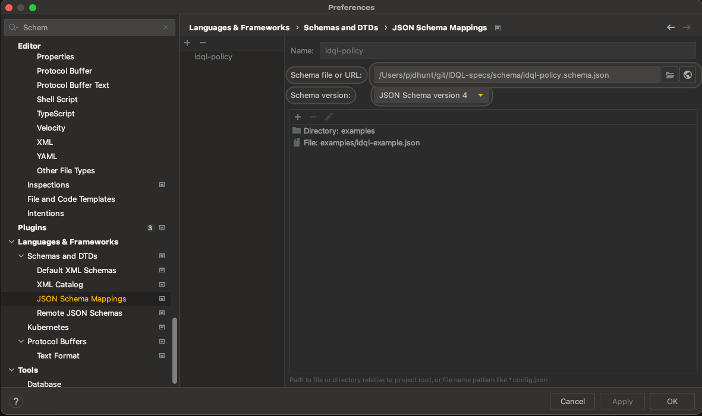

# IDQL Specifications

Version: 0.1 (initial)

## Introduction

IDentity Query Language is a set of specifications that defines "meta" policy that can be applied across muli-cloud 
and multi-layer cloud native applications. IDQL is intended to work with gateways and adapters that map meta policy 
to operational contexts where policy is implemented and enforced. The goal of IDQL is to give policy administrators 
application or organization wide view into the access and policy rules operating.

Mapping of IDQL is intended to be bi-directional in the sense that IDQL can be generated by querying existing policy 
systems and translating into equivalent IDQL policy. Then, after review and revision, an administrator may update 
policy as desired.

All IDQL specifications follow a common set of conventions and formats. For more information see 
[IDQL Conventions](Conventions.md).

Specifications:
* [Core IDQL specification](IDQL-core-specification.md)
* Sources and Assets
  * [Identity Provider specification](IDQL-providers.md)
  * [Objects Specifications](IDQL-assets.md)
* Json Schema
  * [IDQL Policy Schema](../schema/idql-policy.schema.json)

## IDE Notes:

### IntelliJ
IntelliJ has a JSON Schema plugin called [Json To Schema](https://plugins.jetbrains.com/plugin/17611-json-to-schema).
This plugin can be used to both generate JSON Schema files and validate IDQL Policy in JSON form. To enable policy 
validation, open the preferences pain and go to JSON Schema Mappings. Select the 
[idql-policy.schema.json](../schema/idql-policy.schema.json) file and select the files or directories you want to validate.

