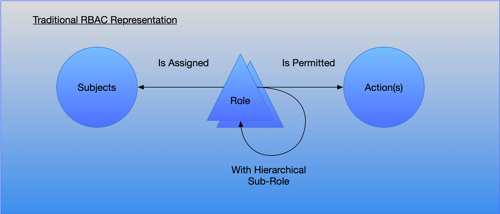
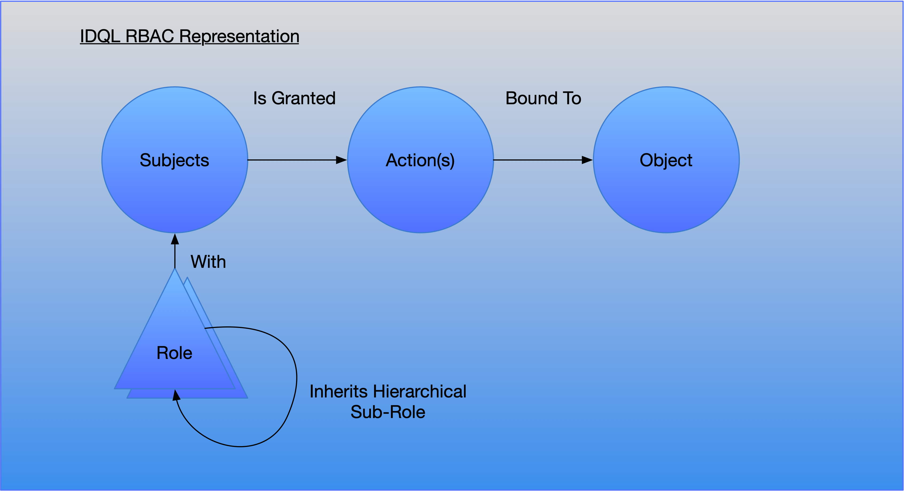
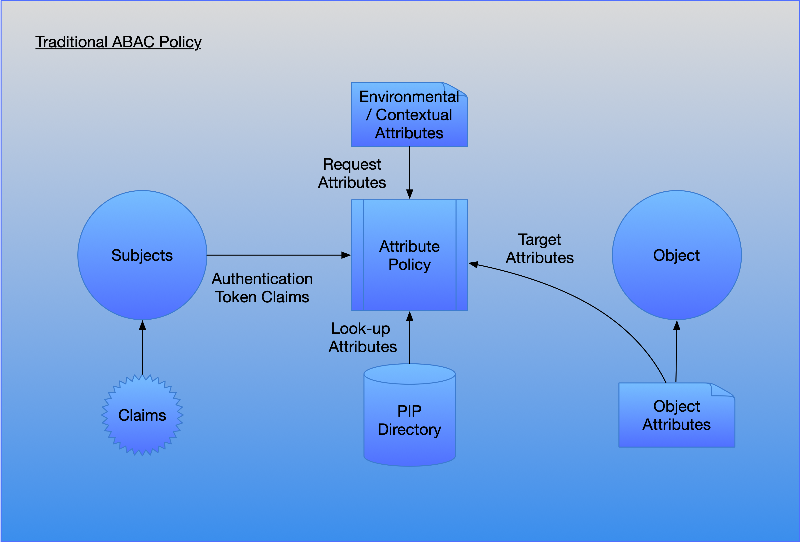
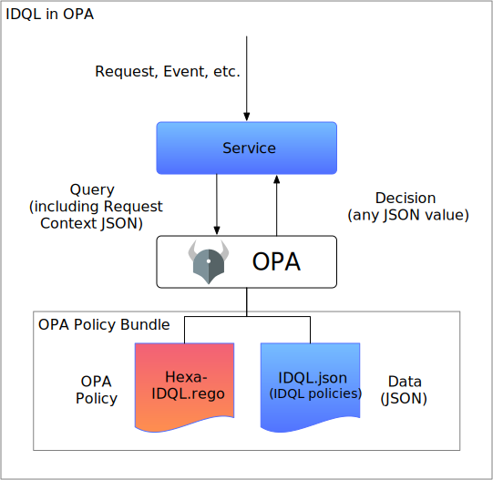

# Discussion of Policy Formats and Mapping to IDQL

## Introduction

Authorization Policy is a general approach in computer science and security systems that suggests a language that
can be used specify enforcement rules that requests from actors (`Subjects`) must be in compliance with for a
transaction to proceed or in some cases for results to return. Policy language breaks down into two major forms: **policy tuples**
and **declarative policy** language.

A policy tuple is simply an array of parameter values used by a policy decision engine to interpret allow or deny rules
for a transactions. Examples of tuples are: Attribute Based Access Control (ABAC) and Role-Based Access Control (RBAC). 

A declarative policy language is a non-procedural language which describes a series of tests to be performed but as
with a declarative programming language does not directly describe how to do it. An example of a declarative policy language
is [Open Policy Agent's Rego](https://www.openpolicyagent.org/docs/latest/policy-language/).

### Terminology:

Traditional enterprise security would break this
down into the following Policy components:

* Policy Administration Point (eg. a cloud control plane API)
* Policy Decision Point (eg. an authorization service)
* Policy Enforcement Point (eg. a proxy or application)
* Policy Information Point (e.g. a directory or transactional context)

### Introducing IDQL


IDQL is a five-part policy language in "tuple" form intended to act as a neutral representation for most existing policy languages
from RBAC and ABAC to Zanzibar and compatible with Rego. The five parts of IDQL represent:

* `Subjects` - What actors are to be matched to a policy. This includes notions of something you are or have such as
  subject identifiers, email, roles, groups memberships, and other inbound criteria.
* `Actions` - Are actions that may be permited or denied based on the request. A permitted action can be a role or
  entitlement, or it could be simply a protocol matched request such as HTTP POST.
* `Object` - Are the targets upong which the actions are to be granted or denied.
  IDQL has 2 other components which describe:
* Conditions - Matching conditions for which the policy is eff3ective of excluded. This can be ABAC matching c onditions
  or request matching conditions (e.g. the IP address mask for the HTTP client).
* Scope - Represents further restrictions on the scope of access. A scope could be a restriction to a subset of rows or
  columns in a table, or to a specific document or set of documents.

The following sections describe how different policy models map to IDQL.

## RBAC - Role Based Access Control

Role based access control (defined
in [NIST SP-800-53 page 4](https://nvlpubs.nist.gov/nistpubs/SpecialPublications/NIST.SP.800-53r5.pdf)) is a policy tuple based
on roles that are typically assigned to a subject actor (User, Device, Application) or granted as a permission. In a simple
form, a policy could list every subject and what their rights are. However doing this, means that security policy must change
every time the database of Subjects changes. This quickly bogs down.  RBAC avoids this by grouping permissions together in
logical "roles" that express common capabilities.  For example:  Create, Read, Write, Update, Delete. Rather than descreet operations, roles
can also be grouped in terms that make sense in the context of an application. For example, in a document management system the
roles might be:  contributor, editor, reviewer, publisher.  In production use, Subjects are assigned roles (e.g. editor), and the 
policy rules then describe what an "editor" can do. Roles are valuable because they separate the tasks of assigning roles (identity management)
from defining access rules (policy management).

In some variations of RBAC, roles can be hierarchical. For exammple,a role such as "editor" might contain the roles "creator, updater, reviewer, publisher".
Various forms of RBAC systems are commonly known as follows:

* **Flat** roles are simple roles directly assigned to a Subject. A role can also be an authorization scope such as
  assigned in an OAuth token.
* **Hierarchical** roles are roles that are made up of one or more sub-roles. The a Subject with a hierarchical
  superordinate role also acquires the rights of any subordinate role.
* **Constrained RBAC** allows roles that may be restricted or disallowed. In IDQL `Actions`, this is expressed using
  the `exclude` option.
* **Symmetric RBAC** allows hierarchical roles where constraints can be applied to points in the hierarchy. In IDQL a
  specific `Action` would be defined that excludes either a superordinate role or a subordinate role as desired using
  the `eclude` option.

<p align="center"></p>

Roles can be expressed in policy in two ways. Roles can be associated with Subjects (something they are), and associated with 
permissions or actions (something that is granted).  

### Subject Roles

Roles for Subjects are often asserted as claims in [JWT](https://www.rfc-editor.org/rfc/rfc7519) or 
[SAML](http://docs.oasis-open.org/security/saml/Post2.0/sstc-saml-tech-overview-2.0.html) tokens issued by an Identity 
Provider that first authenticates a Subject and issues an identity token. Additionally a Policy Decision Point with 
access to a a Directory (a PIP) may also do a secondary lookup to obtain local roles associated with a Subject.

### Roles in Actions
In addition to attaching roles to a Subject, roles can be associated with actions exposed in APIs or in protocol (e.g. HTTP DELETE).
In this form, a role is expressing entitlements or permissions granted to the subject. Thus a policy can consider roles a Subject has and then
grant or deny roles available in a target service.


<p align="center"></p>

In IDQL, roles can be associated with multiple parts of an IDQL policy.

* `Subjects` can contain a matching condition requiring one or more roles.
* `Actions` can assert roles or entitlements to be granted in the target object. For example, Google Identity Aware
  Proxy
  allows an end-user to access a backend service if granted the role `roles/iap.httpsResourceAccessor`.
* `Object` (future) can have a role (aka tag) which indicates whether the policy is to be appied to the object. This
  allows policy to be matched against target objects as is done with tags in Kubernetes.

In the following example, that following is an RBAC policy that allows OpenID authenticated users from Contoso with the roles
employee and manager to read data from HrDatabase:
```yaml
idql-policies:
  - subject:
      type: OP 
      providerId: contoso
      roles:
         - "employee"
         - "manager"
    actions:
      - name: ReadData
        actionUri: urn:Read
    object:
        assetId: HrDatabase
```

## ABAC - Attribute Based Access Control

Attribute Based Access Control (as defined
in [NIST SP-800-162](https://csrc.nist.gov/publications/detail/sp/800-162/final))
is an access control are based on attribute conditions of a Subject, target Object, or other environmental attributes (
e.g. session information, client IP). IDQL's `Condition` clause is
used for this purpose and can express a logical filter based on available run time attributes. In ideal situation,
attributes tested should be part of the existing information set and where possible avoid secondary lookups in a PIP service.

<p align="center"> </p>

In IDQL attribute conditions can be expressed in multiple parts:
* `Subjects` - may be matched using roles, domains, email, or identifier.
* `Condition` - may be expressed as an attribute based boolean condition for the IDQL rule to either allow or deny the request.

The following is an example of an ABAC policy expressed in IDQL YAML form. It grants OpenID connect authenticated users from constoso.com domain to access
specific fields of an HrDatabase providing they are employees and members of the HR department. Note that the values
for the condition are assumed to be provided as part of JWt claims available in the OpenID Identity Token.
```yaml
idql-policies:
    - id: AbacExample
      subject:
        type: OP
        providerId: contoso.com
        members:
          - domain:contoso.com
      actions:
        - name: ReadData
          actionUri: urn:Read
      object:
        assetId: HrDatabase
      condition:
        rule: "subject.jwt.employee eq true and subject.jwt.dept eq \"HR\""
        action: allow
      scopes:
        - name: hrFields
          value: "Salary,HomeAddress"
---
```


## Zanzibar 
[Zanzibar](https://research.google/pubs/pub48190/) is a policy authorization system published by Google. From the paper:
>In Zanzibar, ACLs are collections of object-user or object- object relations represented as relation tuples.  
>Groups are simply ACLs with membership semantics. Relation tuples have efficient binary encodings, but in this paper we repre- sent them using a convenient text notation:
> 
>⟨tuple⟩ ::= ⟨object⟩‘#’⟨relation⟩‘@’⟨user⟩ <br>
>⟨object⟩ ::= ⟨namespace⟩‘:’⟨object id⟩ <br>
>⟨user⟩ ::= ⟨user id⟩ | ⟨userset⟩ <br>
>⟨userset⟩ ::= ⟨object⟩‘#’⟨relation⟩

To translate to IDQL, a Zanzibar `(relation)` is similar to a `actions` that express roles or permissions on an `object`. Because of the way Zanzibar tuples build, 
the roles expressed are hierarchical (as discussed in RBAC above).

As with IDQL, Zanzibar uses configurations to describe Users (Subjects) and Objects.

Relationships (like IDQL Action roles) are defined in a particular way (from the Google paper):
```text
name: "doc"
relation { name: "owner" }
relation {
 name: "editor"
 userset_rewrite {
  union {
   child { _this {} }
   child { computed_userset { relation: "owner" } }
}}}
relation {
 name: "viewer"
 userset_rewrite {
  union {
   child { _this {} }
   child { computed_userset { relation: "editor" } }
   child { tuple_to_userset {
     tupleset { relation: "parent" }
     computed_userset {
       object: $TUPLE_USERSET_OBJECT  # parent folder
relation: "viewer" }}}
}}}
```
_**To be completed**_

## Open Policy Agent Rego
[Rego is a declarative policy language](https://www.openpolicyagent.org/docs/latest/policy-language/) used by [OpenPolicyAgent](https://www.openpolicyagent.org).
In the [Hexa Project](https://www.cncf.io/projects/hexa/), IDQL is supported directly in Rego through the use of an Hexa-IDQL Rego script that parses standard
IDQL tuples inside an OPA decision processor. Rather than transform IDQL into Rego, OPA simply interprets IDQL Policy using Rego. To "run" IDQL, an
OPA "bundle" is created that includes the Hexa Rego code and IDQL Policy as "data". A normal OPA client provides standardized contextual input
information so that IDQL Subjects, Actions, and Objects may be validated inside OPA.
<p align="center"></p>
In the diagram above, fixed Hexa-IDQL.rego code is bundled with IDQL policy tuples in the form of a Data json file. When a client
makes a request to a service, the service calls an OPA Agent to make a policy decision query. The query includes information about
the request (e.g. HTTP information such as path) received including the Subject authorization token. Upon receipt of the 
request, the OPA agent executes the Hexa-IDQL.rego code including the contextual input provided by the Service client and processes it
against the bundled IDQL.json policies to produce a response.

## Federation and Policy

How does federation impact assessment of roles a subject has vs. granted? How is ABAC impacted by federation?

